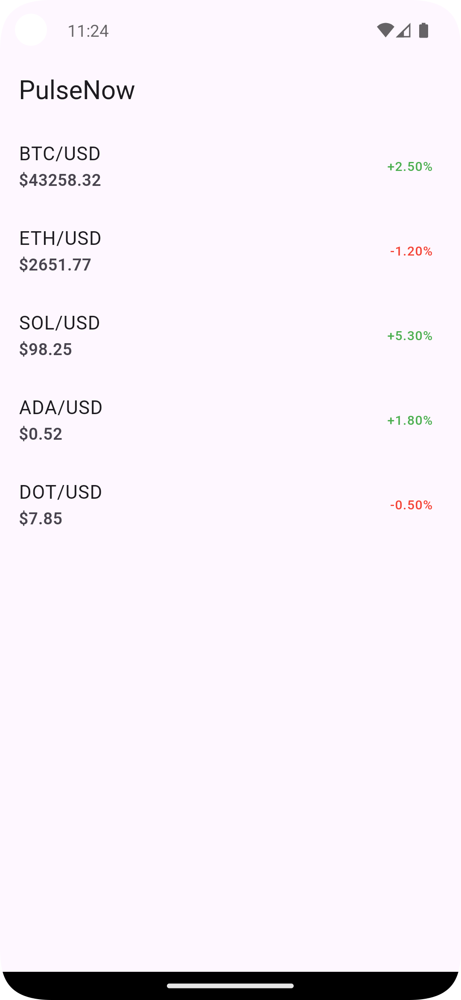

# Flutter Market Data App

A Flutter mobile application that displays real-time crypto market data, including symbol, price, and 24h changes. Built using **Flutter 3.0+**, **Provider** for state management, and a Node.js mock backend.



---

## 🏗️ Project Overview

- **Platform:** Android (tested)  
- **Framework:** Flutter 3.0+  
- **State Management:** Provider  
- **Networking:** http package  
- **Backend:** Node.js mock server (provided)

---

## 🚀 Features Implemented

### Required (Must Complete)

- ✅ API Integration: Calls `/api/market-data`, parses JSON, handles errors  
- ✅ Data Model: `MarketData` with `symbol`, `price`, `change24h`, `changePercent24h`, null-safe, `fromJson` constructor  
- ✅ State Management: `MarketDataProvider` with loading, data, and error states  
- ✅ UI Screen: ListView.builder with symbol, price, 24h change (color-coded), loading indicator, error message, empty state, and pull-to-refresh  
- ✅ Code Quality: Clean, readable, maintainable, null-safe, compiles without errors  

### Optional (Nice-to-Have) Implemented

- Pull-to-refresh ✅  
- Empty state message ✅  
- Retry button on error ✅  
- Color-coded 24h change using constants ✅  

> Other optional enhancements (animations, WebSocket, offline caching, unit tests) not implemented due to time constraints.

---

## 📦 Getting Started

### Prerequisites

- Node.js v16+  
- Flutter SDK 3.0+  
- Android Studio / Xcode (optional for iOS)  
- Git  

### Setup

1. **Backend**
```bash
cd backend
npm install
npm start
